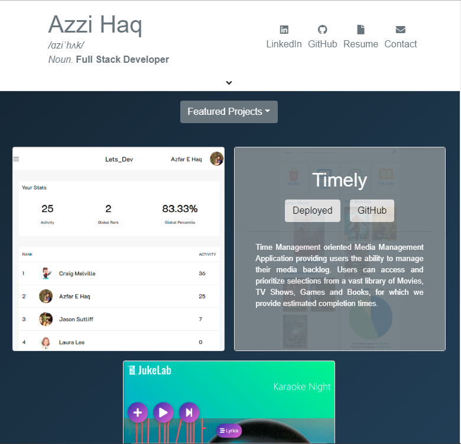

# TheHaqer.com

This repository is for my portfolio website, TheHaqer.com, which showcases a selection of personal projects made by me, Azzi Haq.

Please feel free to visit the site, and browse my work. If you are interested in the architecture of this application, please feel free to browse the code or review the technologies used below.

## Preview

## Technology Used

- React.js
- Google Domains
- Github Pages
- Reactstrap 
  - A framework providing bootstrap components for use with React.
- Font Awesome 
  - An icon set and toolkit for web development.
- React-animated-css 
  - An NPM package to simplify the implementation of the Animated.css library.

## Author
Azfar Haq

## License

Standard MIT License
